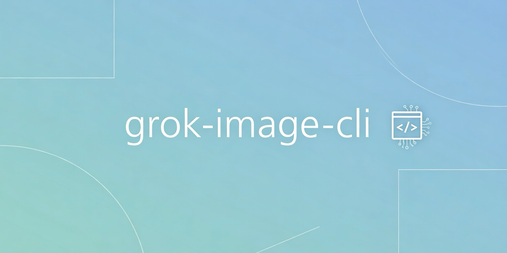

<p align="center">
  
</p>

# grok-img

CLI for generating and editing images with Grok API, powered by `@ai-sdk/xai`.

Supports multiple models: `grok-imagine-image` (default), `grok-imagine-image-pro`, `grok-2-image-1212`.

## Installation

```bash
npm install -g grok-image-cli
```

### From source

```bash
git clone https://github.com/cyberash-dev/grok-image-cli.git
cd grok-image-cli
npm install
npm run build
npm link
```

## Authentication

The CLI stores your xAI API key securely in the OS native credential store (macOS Keychain, Windows Credential Manager, Linux Secret Service) via `cross-keychain`. Alternatively, set the `XAI_API_KEY` environment variable.

```bash
grok-img auth login    # Save API key (interactive prompt)
grok-img auth status   # Check authentication status
grok-img auth logout   # Remove API key
```

## Image Generation

```bash
grok-img generate "A futuristic city skyline at night"
grok-img generate "Mountain landscape at sunrise" -n 4 -a 16:9
grok-img generate "A serene Japanese garden" -o ./my-images
grok-img generate "Photorealistic portrait" -m grok-imagine-image-pro
```

### Options

| Option | Description | Default |
|--------|-------------|---------|
| `-m, --model <model>` | Model (`grok-imagine-image`, `grok-imagine-image-pro`, `grok-2-image-1212`) | `grok-imagine-image` |
| `-a, --aspect-ratio <ratio>` | Aspect ratio (`1:1`, `16:9`, `9:16`, `4:3`, `3:4`, `3:2`, `2:3`, `2:1`, `1:2`, `19.5:9`, `9:19.5`, `20:9`, `9:20`, `auto`) | `auto` |
| `-n, --count <number>` | Number of images (1-10) | `1` |
| `-o, --output <dir>` | Output directory | `./grok-images` |

## Image Editing

```bash
grok-img edit "Make it look like a watercolor painting" -i ./photo.jpg
grok-img edit "Change the sky to sunset colors" -i https://example.com/photo.jpg
grok-img edit "Add a vintage film grain effect" -i ./photo.jpg -a 3:2 -o ./edited
grok-img edit "Render as pencil sketch" -i ./photo.jpg -m grok-imagine-image-pro
```

### Options

| Option | Description | Default |
|--------|-------------|---------|
| `-i, --image <path>` | Source image (local path or URL) | **required** |
| `-m, --model <model>` | Model (`grok-imagine-image`, `grok-imagine-image-pro`, `grok-2-image-1212`) | `grok-imagine-image` |
| `-a, --aspect-ratio <ratio>` | Aspect ratio | `auto` |
| `-o, --output <dir>` | Output directory | `./grok-images` |

## Models

| Model | Modalities | Rate Limit | Price |
|-------|------------|------------|-------|
| `grok-imagine-image` | text, image -> image | 300 RPM | $0.02/image |
| `grok-imagine-image-pro` | text, image -> image | 30 RPM | $0.07/image |
| `grok-2-image-1212` | text -> image | 300 RPM | $0.07/image |

`grok-2-image-1212` does not support `aspect_ratio: "auto"` or image editing.

## Development

```bash
npm install
npm run dev          # watch mode
npm run build        # production build
npm run lint         # check linting
npm run lint:fix     # auto-fix lint issues
npm run format       # format code
```

## Architecture

This project follows Clean Architecture principles:

```
src/
  main.ts                        # Composition root
  domain/                        # Entities & port interfaces (zero deps)
  application/                   # Use cases (depends on domain only)
  infrastructure/                # Adapters (@ai-sdk/xai, cross-keychain, fs)
  presentation/                  # CLI commands (commander)
```

## Requirements

- Node.js >= 20.19.0
- macOS, Windows, or Linux
- xAI API key from [console.x.ai](https://console.x.ai)

## License

MIT
