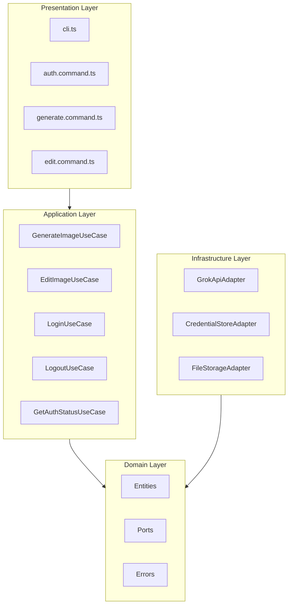
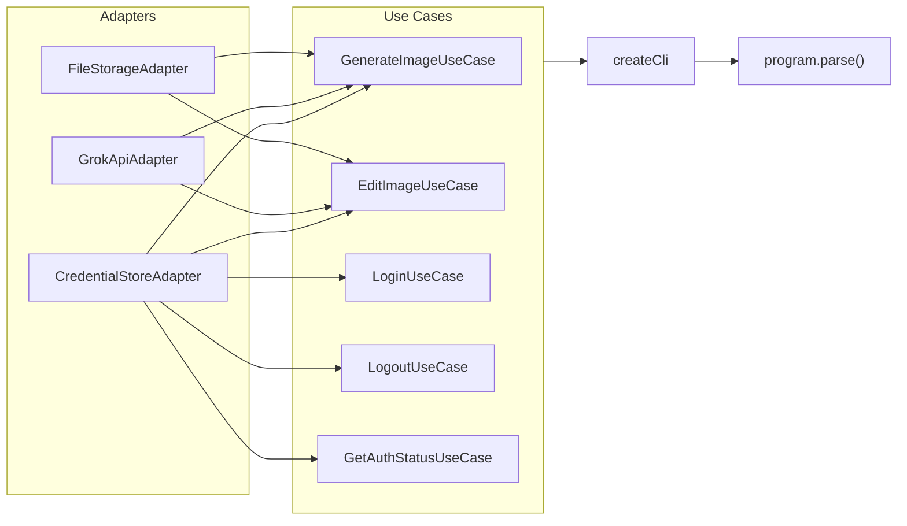

# Архитектура grok-image-cli

## Обзор

`grok-image-cli` — CLI-утилита для генерации и редактирования изображений через xAI Grok API. Устанавливается как npm-пакет, предоставляет команду `grok-img`.

- **Версия**: 0.1.1
- **Лицензия**: MIT
- **Платформа**: кроссплатформенная (macOS, Windows, Linux)
- **Runtime**: Node.js >= 20.19.0, ESM

## Архитектурный стиль

Проект построен на принципах **Clean Architecture** с чётким разделением на четыре слоя. Зависимости направлены внутрь — внешние слои зависят от внутренних, но не наоборот.



## Структура проекта

```
src/
├── main.ts                          # Composition Root
├── domain/
│   ├── entities/
│   │   ├── generate-params.ts       # GenerateParams
│   │   ├── edit-params.ts           # EditParams
│   │   └── image-result.ts          # ImageResult
│   ├── errors.ts                    # ApiKeyMissingError, ApiError, ImageNotFoundError
│   └── ports/
│       ├── image-generator.port.ts  # ImageGeneratorPort
│       ├── file-storage.port.ts     # FileStoragePort
│       └── key-store.port.ts        # KeyStorePort
├── application/
│   └── usecases/
│       ├── generate-image.usecase.ts
│       ├── edit-image.usecase.ts
│       ├── login.usecase.ts
│       ├── logout.usecase.ts
│       └── get-auth-status.usecase.ts
├── infrastructure/
│   └── adapters/
│       ├── grok-api.adapter.ts              # ImageGeneratorPort → xAI SDK
│       ├── credential-store.adapter.ts      # KeyStorePort → cross-keychain
│       └── file-storage.adapter.ts          # FileStoragePort → Node.js fs
└── presentation/
    ├── cli.ts                       # Commander program
    └── commands/
        ├── auth.command.ts          # login / logout / status
        ├── generate.command.ts      # generate <prompt>
        └── edit.command.ts          # edit <prompt> -i <image>
```

## Domain Layer

Ядро приложения. Не имеет внешних зависимостей.

### Сущности

| Сущность | Файл | Назначение |
|---|---|---|
| `GenerateParams` | `domain/entities/generate-params.ts` | Параметры генерации изображения |
| `EditParams` | `domain/entities/edit-params.ts` | Параметры редактирования изображения |
| `ImageResult` | `domain/entities/image-result.ts` | Результат генерации/редактирования |

Подробное описание каждой сущности — в `spec/entities/`.

### Порты

Порты определяют контракты для взаимодействия с внешними системами. Реализуются адаптерами в Infrastructure Layer.

#### ImageGeneratorPort

Файл: `domain/ports/image-generator.port.ts`

```typescript
type ImageGeneratorPort = {
  generate(params: GenerateParams, apiKey: string): Promise<ImageResult[]>
  edit(params: EditParams, apiKey: string): Promise<ImageResult>
}
```

- `generate` — генерация изображений по текстовому промпту, возвращает массив результатов
- `edit` — редактирование существующего изображения по промпту, возвращает один результат

#### KeyStorePort

Файл: `domain/ports/key-store.port.ts`

```typescript
type KeyStorePort = {
  save(key: string): Promise<void>
  get(): Promise<string | null>
  remove(): Promise<void>
}
```

- `save` — сохранить API-ключ
- `get` — получить API-ключ (или `null`, если не найден)
- `remove` — удалить API-ключ

#### FileStoragePort

Файл: `domain/ports/file-storage.port.ts`

```typescript
type FileStoragePort = {
  saveImage(data: Uint8Array, outputPath: string): Promise<string>
  readImage(filePath: string): Promise<Uint8Array>
  ensureDir(dir: string): void
  generateOutputPath(dir: string, index: number, mediaType: string): string
}
```

- `saveImage` — сохранить бинарные данные по указанному пути, вернуть путь
- `readImage` — прочитать файл изображения как `Uint8Array`
- `ensureDir` — создать директорию рекурсивно, если не существует
- `generateOutputPath` — сформировать путь для выходного файла на основе директории, индекса и MIME-типа

### Доменные ошибки

Файл: `domain/errors.ts`

| Ошибка | Когда выбрасывается |
|---|---|
| `ApiKeyMissingError` | API-ключ не найден ни в системном хранилище, ни в переменной окружения |
| `ApiError` | Ошибка при обращении к xAI API (включает `cause` для оригинальной ошибки) |
| `ImageNotFoundError` | Локальный файл изображения не существует по указанному пути |

## Application Layer

Содержит юзкейсы — бизнес-логику приложения. Зависит только от Domain Layer (сущности, порты, ошибки).

| Юзкейс | Файл | Назначение |
|---|---|---|
| `GenerateImageUseCase` | `application/usecases/generate-image.usecase.ts` | Генерация изображений и сохранение на диск |
| `EditImageUseCase` | `application/usecases/edit-image.usecase.ts` | Редактирование изображения и сохранение на диск |
| `LoginUseCase` | `application/usecases/login.usecase.ts` | Сохранение API-ключа |
| `LogoutUseCase` | `application/usecases/logout.usecase.ts` | Удаление API-ключа |
| `GetAuthStatusUseCase` | `application/usecases/get-auth-status.usecase.ts` | Проверка статуса аутентификации |

Подробное описание каждого юзкейса — в `spec/usecases/`.

## Infrastructure Layer

Реализация портов через конкретные внешние зависимости. Зависит от Domain Layer.

### GrokApiAdapter

Файл: `infrastructure/adapters/grok-api.adapter.ts`

Реализует `ImageGeneratorPort`. Использует `@ai-sdk/xai` и `ai` SDK для взаимодействия с xAI API.

- **Модель**: `grok-imagine-image`
- **Генерация**: вызов `generateImage()` с текстовым промптом
- **Редактирование**: вызов `generateImage()` с промптом и изображением-источником (URL или `Uint8Array`)
- **Обработка ошибок**: перехват `NoImageGeneratedError` и обёртка в доменный `ApiError`

### CredentialStoreAdapter

Файл: `infrastructure/adapters/credential-store.adapter.ts`

Реализует `KeyStorePort`. Хранит API-ключ в нативном хранилище ОС через библиотеку `cross-keychain`.

- **Поддерживаемые ОС**:
  - macOS — Keychain
  - Windows — Credential Manager
  - Linux — Secret Service (libsecret)
- **Service**: `grok-image-cli`
- **Account**: `api-key`
- **save**: `setPassword("grok-image-cli", "api-key", key)`
- **get**: `getPassword("grok-image-cli", "api-key")`, при неудаче — fallback на `process.env.XAI_API_KEY`
- **remove**: `deletePassword("grok-image-cli", "api-key")`

### FileStorageAdapter

Файл: `infrastructure/adapters/file-storage.adapter.ts`

Реализует `FileStoragePort`. Работа с файловой системой через Node.js `fs`.

- **Формат имени файла**: `grok-img-{timestamp}-{index}.{ext}`
- **Поддерживаемые форматы**: `image/png` → `.png`, `image/jpeg` → `.jpg`, `image/webp` → `.webp`, `image/gif` → `.gif`
- **Формат по умолчанию**: `.png`

## Presentation Layer

CLI-интерфейс на базе `commander`. Зависит от Application Layer.

### Команды

| Команда | Описание |
|---|---|
| `grok-img auth login` | Ввод и сохранение API-ключа в системном хранилище |
| `grok-img auth logout` | Удаление API-ключа из системного хранилища |
| `grok-img auth status` | Проверка статуса аутентификации |
| `grok-img generate <prompt>` | Генерация изображений по промпту |
| `grok-img edit <prompt> -i <image>` | Редактирование изображения по промпту |

### Опции команды generate

| Опция | Описание | По умолчанию |
|---|---|---|
| `-a, --aspect-ratio <ratio>` | Соотношение сторон | `auto` |
| `-n, --count <number>` | Количество изображений (1-10) | `1` |
| `-o, --output <dir>` | Директория для сохранения | `./grok-images` |

### Опции команды edit

| Опция | Описание | По умолчанию |
|---|---|---|
| `-i, --image <path>` | Исходное изображение (путь или URL) | обязательный |
| `-a, --aspect-ratio <ratio>` | Соотношение сторон | `auto` |
| `-o, --output <dir>` | Директория для сохранения | `./grok-images` |

### Допустимые значения aspect-ratio

`1:1`, `16:9`, `9:16`, `4:3`, `3:4`, `3:2`, `2:3`, `2:1`, `1:2`, `19.5:9`, `9:19.5`, `20:9`, `9:20`, `auto`

### UI-библиотеки

- `chalk` — цветной вывод в терминал
- `ora` — spinner для индикации загрузки
- `readline` — ввод API-ключа при `auth login`

## Composition Root

Файл: `src/main.ts`

Точка входа приложения. Создаёт экземпляры адаптеров, инжектирует их в юзкейсы, собирает CLI-программу и запускает парсинг аргументов.



## Стек технологий

| Категория | Технология | Версия |
|---|---|---|
| Runtime | Node.js | >= 20.19.0 |
| Язык | TypeScript | 5.9.3 |
| Модули | ESM | — |
| Сборка | tsdown | 0.20.3 |
| Линтер/Форматтер | Biome | 2.3.14 |
| CLI-фреймворк | commander | 13.1.0 |
| AI SDK | @ai-sdk/xai + ai | 3.0.53 / 6.0.80 |
| Хранение ключей | cross-keychain | latest |
| UI (терминал) | chalk, ora | 5.6.2 / 8.2.0 |

## Сборка и дистрибуция

- **Сборка**: `tsdown` собирает `src/main.ts` в `dist/main.mjs` (ESM, target Node 20)
- **Shebang**: `#!/usr/bin/env node` добавляется автоматически через banner
- **Source maps**: включены
- **Публикация**: автоматическая через GitHub Actions при создании release
- **npm-пакет**: включает `dist/`, `README.md`, `LICENSE`

## Безопасность

- API-ключ хранится в нативном хранилище ОС (macOS Keychain / Windows Credential Manager / Linux Secret Service), не записывается в файлы
- Fallback через переменную окружения `XAI_API_KEY`
- Все запросы к API — по HTTPS
- При отображении ключа в `auth status` — маскировка (первые 4 + последние 4 символа)
