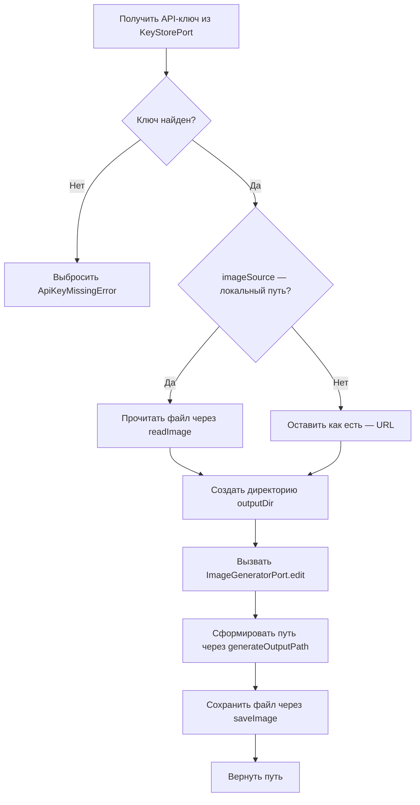

# EditImageUseCase

Редактирование существующего изображения по текстовому промпту и сохранение результата на диск.

**Файл**: `src/application/usecases/edit-image.usecase.ts`

## Зависимости (порты)

| Порт | Назначение |
|---|---|
| `ImageGeneratorPort` | Редактирование изображения через xAI API |
| `KeyStorePort` | Получение API-ключа |
| `FileStoragePort` | Чтение исходного и сохранение результата |

## Сигнатура

```typescript
execute(params: EditParams, outputDir: string): Promise<string>
```

## Входные параметры

| Параметр | Тип | Описание |
|---|---|---|
| `params` | `EditParams` | Параметры редактирования (prompt, imageSource, aspectRatio, model) |
| `outputDir` | `string` | Абсолютный путь к директории для сохранения |

## Выходные данные

`string` — абсолютный путь к сохранённому файлу.

## Алгоритм



1. Получить API-ключ через `keyStore.get()`
2. Если ключ не найден — выбросить `ApiKeyMissingError`
3. Если `imageSource` — строка, не начинающаяся с `http`:
   - Прочитать файл через `fileStorage.readImage(imageSource)` → `Uint8Array`
   - Заменить `imageSource` в параметрах на бинарные данные
4. Создать выходную директорию через `fileStorage.ensureDir(outputDir)`
5. Вызвать `imageGenerator.edit(params, apiKey)` — получить `ImageResult`
6. Сформировать путь через `fileStorage.generateOutputPath(outputDir, 0, mediaType)`
7. Сохранить файл через `fileStorage.saveImage(uint8Array, outputPath)`
8. Вернуть путь

## Ошибки

| Ошибка | Условие |
|---|---|
| `ApiKeyMissingError` | API-ключ не найден |
| `ImageNotFoundError` | Локальный файл изображения не существует |
| `ApiError` | Ошибка xAI API при редактировании |
