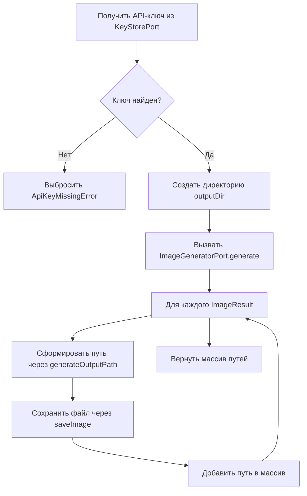

# GenerateImageUseCase

Генерация изображений по текстовому промпту и сохранение результатов на диск.

**Файл**: `src/application/usecases/generate-image.usecase.ts`

## Зависимости (порты)

| Порт | Назначение |
|---|---|
| `ImageGeneratorPort` | Генерация изображений через xAI API |
| `KeyStorePort` | Получение API-ключа |
| `FileStoragePort` | Сохранение файлов на диск |

## Сигнатура

```typescript
execute(params: GenerateParams, outputDir: string): Promise<string[]>
```

## Входные параметры

| Параметр | Тип | Описание |
|---|---|---|
| `params` | `GenerateParams` | Параметры генерации (prompt, count, aspectRatio) |
| `outputDir` | `string` | Абсолютный путь к директории для сохранения |

## Выходные данные

`string[]` — массив абсолютных путей к сохранённым файлам.

## Алгоритм



1. Получить API-ключ через `keyStore.get()`
2. Если ключ не найден — выбросить `ApiKeyMissingError`
3. Создать выходную директорию через `fileStorage.ensureDir(outputDir)`
4. Вызвать `imageGenerator.generate(params, apiKey)` — получить `ImageResult[]`
5. Для каждого результата:
   - Сформировать путь через `fileStorage.generateOutputPath(outputDir, index, mediaType)`
   - Сохранить файл через `fileStorage.saveImage(uint8Array, outputPath)`
   - Добавить путь в массив результатов
6. Вернуть массив путей

## Ошибки

| Ошибка | Условие |
|---|---|
| `ApiKeyMissingError` | API-ключ не найден |
| `ApiError` | Ошибка xAI API при генерации |
