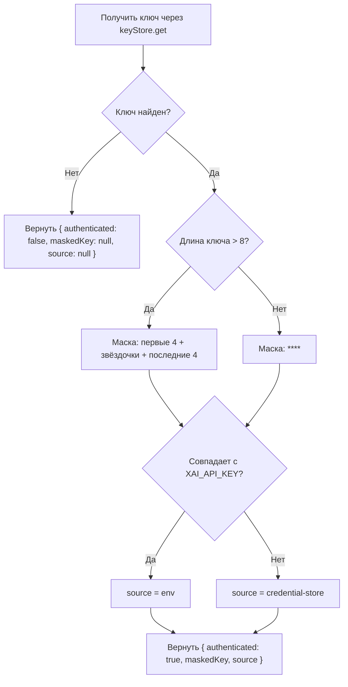

# GetAuthStatusUseCase

Проверка текущего статуса аутентификации — наличие API-ключа и его источник.

**Файл**: `src/application/usecases/get-auth-status.usecase.ts`

## Зависимости (порты)

| Порт | Назначение |
|---|---|
| `KeyStorePort` | Получение API-ключа |

## Сигнатура

```typescript
execute(): Promise<AuthStatus>
```

## Тип AuthStatus

```typescript
type AuthStatus = {
  authenticated: boolean
  maskedKey: string | null
  source: "credential-store" | "env" | null
}
```

| Поле | Тип | Описание |
|---|---|---|
| `authenticated` | `boolean` | Наличие API-ключа |
| `maskedKey` | `string \| null` | Маскированный ключ или `null` |
| `source` | `"credential-store" \| "env" \| null` | Источник ключа или `null` |

## Входные параметры

Нет.

## Выходные данные

`AuthStatus` — объект с информацией о статусе аутентификации.

## Алгоритм



1. Получить ключ через `keyStore.get()`
2. Если ключ не найден — вернуть `{ authenticated: false, maskedKey: null, source: null }`
3. Маскировать ключ:
   - Если длина > 8: `первые 4 символа` + `звёздочки` + `последние 4 символа`
   - Иначе: `****`
4. Определить источник:
   - Если `process.env.XAI_API_KEY === key` → `"env"`
   - Иначе → `"credential-store"`
5. Вернуть `{ authenticated: true, maskedKey: masked, source }`

## Поведение на уровне Presentation

Команда `grok-img auth status`:
- Если аутентифицирован — выводит зелёным "Authenticated", маскированный ключ и источник
- Если не аутентифицирован — выводит жёлтым "Not authenticated" и подсказку
